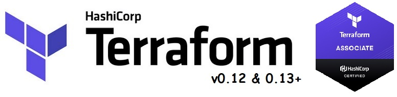

<br>

Course covering all features of Terraform v0.12, v0.13, v0.14, v0.15 and  v1.x
# Terraform Lessons by Denis Astahov


### Set AWS Credentials in Windows PowerShell:
```
$env:AWS_ACCESS_KEY_ID="xxxxxxxxxxxxxxxxx"
$env:AWS_SECRET_ACCESS_KEY="yyyyyyyyyyyyyyyyyyyyyyyyyyyy"
$env:AWS_DEFAULT_REGION="zzzzzzzzz"
```

### Set AWS Credentials in Linux Shell:
```
export AWS_ACCESS_KEY_ID="xxxxxxxxxxxxxxxxx"
export AWS_SECRET_ACCESS_KEY="yyyyyyyyyyyyyyyyyyyyyyyyyyyy"
export AWS_DEFAULT_REGION="zzzzzzzzz"
```

### Terraform Commands
```
terraform init
terraform plan
terraform apply
terraform destroy

terraform show
terraform output
terraform console
terraform import
terraform taint
```

### Terraform State Commands
```
terraform state show
terraform state list
terraform state pull
terraform state rm
terraform state mv
terraform state push
```
`for x in $(terraform state list | grep xyz); do terraform state mv -state-out=”terraform.tfstate”  $x $x; done`


### Terraform Workspace Commands
```
terraform workspace show
terraform workspace list
terraform workspace new
terraform workspace select
terraform workspace delete
```
`${terraform.workspace}`
